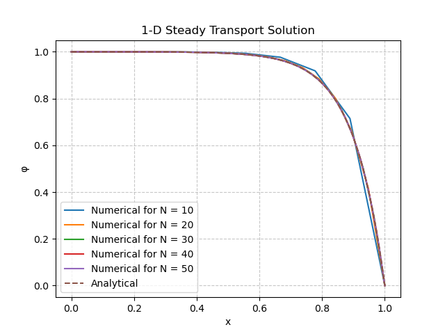
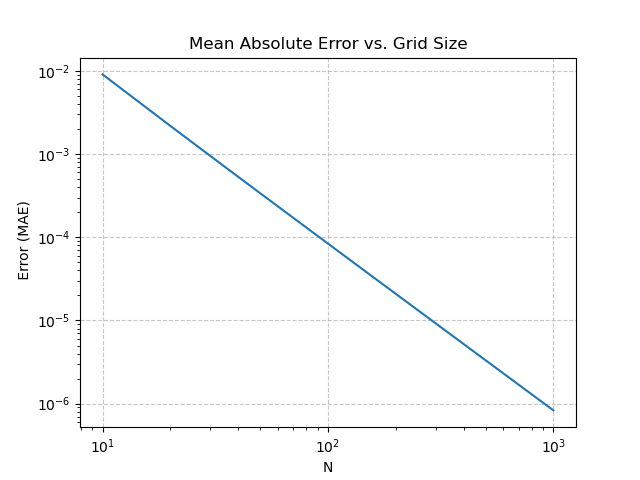
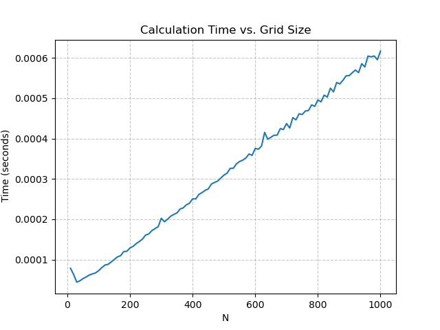
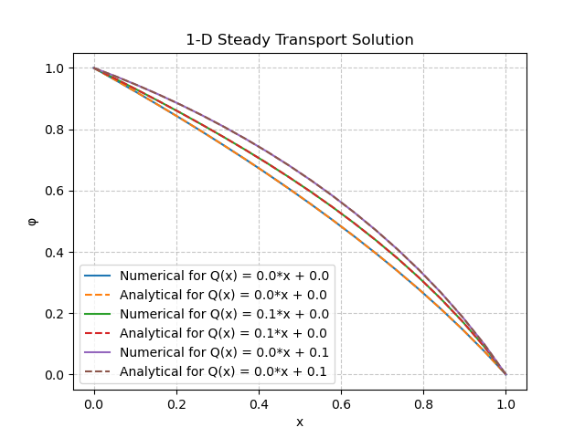

# Homework 1

**Author:** Toby Viet Nguyen

**Scripts Included:** `scalar_transport.py`, `plot_csv.py`, `homework1b.sh`, `homework1c.sh`

**Usage Instructions:** Run commands in a Linux terminal
- `source homework1b.sh` Generate *all* results files for **Problem 1b**
- `source homework1c.sh` Generate *all* results files for **Problem 1c**
- `python scalar_transport.py -b` Run calculations (without generating results files) for **Problem 1b**
- `python scalar_transport.py -c` Run calculations (without generating results files) for **Problem 1c**

## Problem 1a

**Solve numerically the one dimensional steady transport equation with constant $U$ and $L=1$ given by...**

$$
U\frac{\partial \varphi}{\partial x} = \frac{\partial}{\partial x}\left(\Gamma \frac{\partial\varphi}{\partial x}\right) + Q; \varphi(0) = 1; \varphi(L) = 0
$$

**Develop a finite difference algorithm using central differences for the solution of the transport equation. Describe the essential steps.**

Discretize the domain into $N$ grid points with $\Delta x = \frac{L}{N-1}$ such that...

$$
x_1 = 0, x_2 = \Delta x, ..., x_i = (i-1)\Delta x, ..., x_N = (N-1)\Delta x = L
$$

Use central difference on first derivatives.

$$
U\frac{\varphi_{i+1} - \varphi_{i-1}}{2\Delta x} = \frac{\left(\Gamma\frac{\partial\varphi}{\partial x}\right)_{i+\frac{1}{2}} - \left(\Gamma\frac{\partial\varphi}{\partial x}\right)_{i-\frac{1}{2}}}{\Delta x} + Q_i
$$

Use forward difference for $\left(\Gamma\frac{\partial\varphi}{\partial x}\right)_{i+\frac{1}{2}}$ and backward difference for $\left(\Gamma\frac{\partial\varphi}{\partial x}\right)_{i-\frac{1}{2}}$.

$$
U\frac{\varphi_{i+1} - \varphi_{i-1}}{2\Delta x} = \frac{\Gamma_{i+\frac{1}{2}}\left(\frac{\varphi_{i+1}-\varphi_i}{\Delta x}\right) - \Gamma_{i-\frac{1}{2}}\left(\frac{\varphi_i-\varphi_{i-1}}{\Delta x}\right)}{\Delta x} + Q_i
$$

$$
\frac{U}{2\Delta x}\varphi_{i+1} - \frac{U}{2\Delta x}\varphi_{i-1} = \frac{\Gamma_{i+\frac{1}{2}}}{\Delta x^2}\varphi_{i+1} - \frac{\Gamma_{i+\frac{1}{2}} + \Gamma_{i-\frac{1}{2}}}{\Delta x^2}\varphi_i + \frac{\Gamma_{i-\frac{1}{2}}}{\Delta x^2}\varphi_{i-1} + Q_i
$$

$$
\left(\frac{\Gamma_{i-\frac{1}{2}}}{\Delta x^2} + \frac{U}{2\Delta x}\right)\varphi_{i-1} - \left(\frac{\Gamma_{i+\frac{1}{2}} + \Gamma_{i-\frac{1}{2}}}{\Delta x^2}\right)\varphi_i + \left(\frac{\Gamma_{i+\frac{1}{2}}}{\Delta x^2} - \frac{U}{2\Delta x}\right)\varphi_{i+1} = -Q_i
$$

Let $a^W_i = \frac{\Gamma_{i-\frac{1}{2}}}{\Delta x^2} + \frac{U}{2\Delta x}$, $a^P_i = \frac{\Gamma_{i+\frac{1}{2}} + \Gamma_{i-\frac{1}{2}}}{\Delta x^2}$, and $a^E_i = \frac{\Gamma_{i+\frac{1}{2}}}{\Delta x^2} - \frac{U}{2\Delta x}$. Thus, the equation can be rewritten as a matrix-vector problem, $\bf{A\varphi=b}$.

$$
\begin{bmatrix}
1 & 0 & & & & \bf{0}\\
a^W_2 & a^P_2 & a^E_2 \\
& a^W_3 & a^P_3 & a^E_3 \\
& & \ddots & \ddots & \ddots \\
& & & a^W_{N-1} & a^P_{N-1} & a^E_{N-1} \\
\bf{0} & & & & 0 & 1
\end{bmatrix}
\begin{bmatrix}
\varphi_1 \\ \varphi_2 \\ \varphi_3 \\ \vdots \\ \varphi_{N-1} \\ \varphi_N
\end{bmatrix} = 
\begin{bmatrix}
1 \\ -Q_2 \\ -Q_3 \\ \vdots \\ -Q_{N-1} \\ 0
\end{bmatrix}
$$

Since $\bf{A}$ is a tridiagonal matrix, we can use the Thomas algorithm (a.k.a. TDMA).

## Problem 1b

**Set $U = 1, \Gamma = 0.1, Q = 0$. Use TDMA to find $\varphi$. Plot $\varphi$ vs. $x$ on the same graph using grid sizes of $N = 10, 20, 30, 40, 50$ and compare your result to the analytical solution. Plot the average error as a function of $N$ (use a log scale and normalize the error by grid size) and discuss the result. Evaluate the accuracy of the numerical scheme using the error data. Examine how the calculation time changes with $N$ and evaluate the time complexity of the algorithm.**

Unsurprisingly, as the grid size $N$ increases, the average discretization error (normalized by its grid size) decreases. The relationship between the mean absolute error (MAE) and $N$ can be described by a power law, which appears linear in the log-log plot shown in **Figure 1b**. In exchange for accuracy, calculation time increases as $N$ increases. The relationship between calculation and $N$ can be described as linear as shown in **Figure 1c**. Thus, the time complexity of TDMA is $O(N)$.

The source code is found in `scalar_transport.py`. Use the `homework1b.sh` script to regenerate all the images used, or run `python scalar_transport.py -b` to run calculations without regenerating images.

| Figure 1a | Figure 1b | Figure 1c |
|:-:|:-:|:-:|
|  |  |  |

## Problem 1c

**Set $U = 0, \Gamma = 0.1 + 0.1\varphi, N = 20$. Find $\varphi$ using TDMA for $Q = 0, 0.1, 0.1x$. Plot $\varphi$ vs. $x$ for these 3 cases on the same graph and discuss the results. Compare your results with the analytical solutions (shown below). How is the solution method different from (b)? Compare the calculation time with that of (b).**

Unlike **Problem 1b**, we must solve this problem iteratively, since the problem is now nonlinear. Let $\varphi^k$ be the solution at the $k$-th iteration, and choose an initial guess for $\varphi$.

$$
\varphi^0 = 1 - x
$$

Building off of **Problem 1a**...

$$
\left(\frac{\Gamma^k_{i-\frac{1}{2}}}{\Delta x^2} + \frac{U}{2\Delta x}\right)\varphi^{k+1}_{i-1} - \left(\frac{\Gamma^k_{i+\frac{1}{2}} + \Gamma^k_{i-\frac{1}{2}}}{\Delta x^2}\right)\varphi^{k+1}_i + \left(\frac{\Gamma^k_{i+\frac{1}{2}}}{\Delta x^2} - \frac{U}{2\Delta x}\right)\varphi^{k+1}_{i+1} = -Q_i
$$

We can substitute $\Gamma = 0.1 + 0.1\varphi$ and calculate $\Gamma^k_{i\pm\frac{1}{2}}$ as...

$$
\Gamma^k_{i-\frac{1}{2}} = 0.1 + 0.1\varphi^k_{i-\frac{1}{2}} = 0.1 + 0.1\left(\frac{\varphi^k_i + \varphi^k_{i-1}}{2}\right)
$$

$$
\Gamma^k_{i+\frac{1}{2}} = 0.1 + 0.1\varphi^k_{i+\frac{1}{2}} = 0.1 + 0.1\left(\frac{\varphi^k_i + \varphi^k_{i+1}}{2}\right)
$$

This will yield a new matrix-vector equation $\bf{A}^k\bf{\varphi}^{k+1}=\bf{b}$, which can be solved using the same TDMA as **Problem 1b**. To start a new iteration, reassign $\bf{\varphi}^k \leftarrow\bf{\varphi}^{k+1}$. Now, we can recalculate $\Gamma^k_{i\pm\frac{1}{2}}$ and $\bf{\varphi}^{k+1}$. This iterative loop will continue until...

$$
\max_i|\varphi^{k+1}_i-\varphi^k_i| < 10^{-6}
$$

For $Q=0,0.1,0.1x$, the numerical solution is very accurate when compared to the analytical solution as seen in **Figure 2**. The source code is found in `scalar_transport.py`. Use the `homework1c.sh` script to regenerate the plot used, or run `python scalar_transport.py -c` to run calculations without regenerating the plot.

| Figure 2 |
|:-:|
|  |