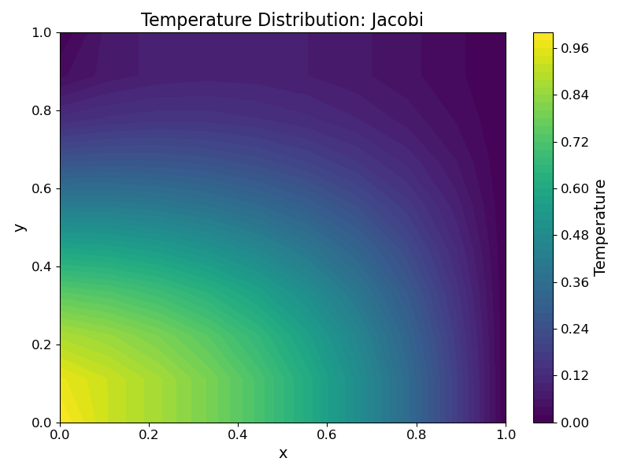
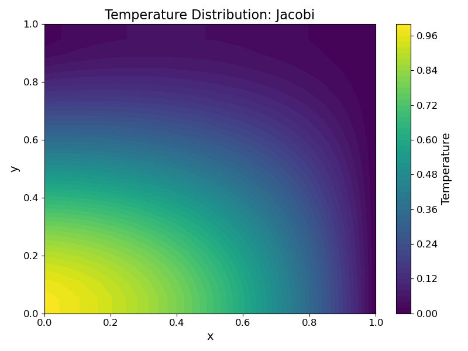
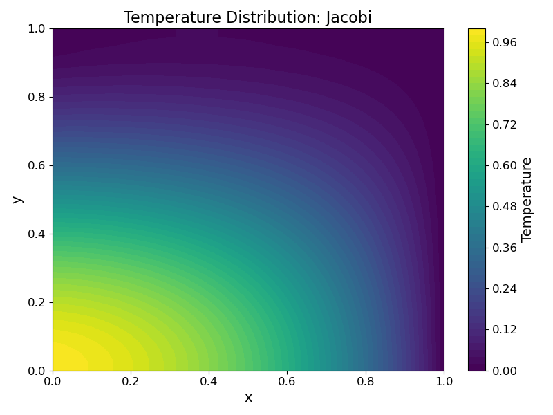
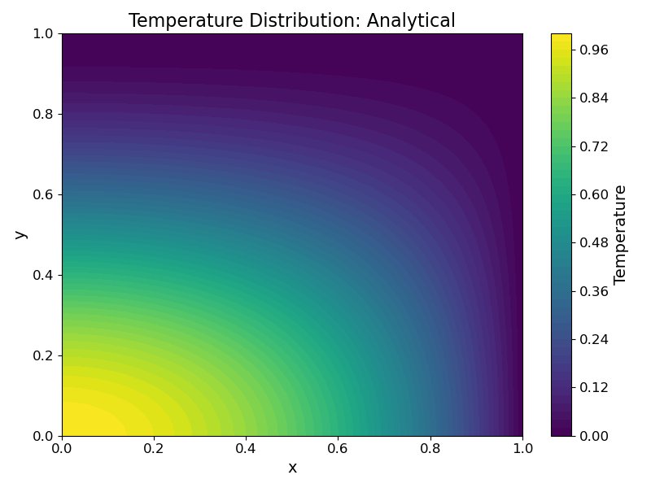
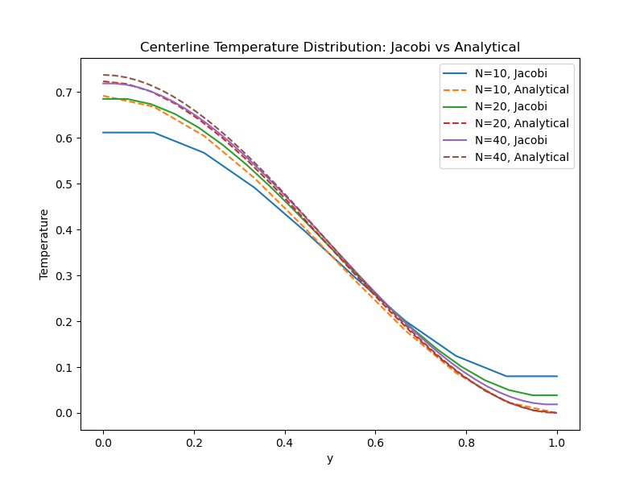

# Homework 2

**Author:** Toby Viet Nguyen

**Files Included:**

**Usage Instructions:**

## Problem 1a

Begin with the 2-D Poisson's equation with $\lambda = 1$.

$$
\frac{\partial^2T}{\partial x^2} + \frac{\partial^2T}{\partial y^2} + Q = 0
$$

Discretize the domain into $N^2$ nodes with grid spacing $\Delta x = \Delta y = h = \frac{1}{N-1}$ such that...

$$
x_{0}=0,x_{1}=h,x_{2}=2h,\dots,x_{i}=ih,\dots,x_{N-1}=1
$$

$$
y_{0}=0,y_{1}=h,y_{2}=2h,\dots,y_{j}=jh,\dots,y_{N-1}=1
$$

Use central differences for both second derivatives.

$$
\frac{T_{i-1,j}-2T_{i,j}+T_{i+1,j}}{\Delta x^2} + \frac{T_{i,j-1}-2T_{i,j}+T_{i,j+1}}{\Delta y^2} + Q_{i,j} = 0
$$

$$
\frac{1}{h^2}T_{i-1,j} + \frac{1}{h^2}T_{i+1,j} + \frac{1}{h^2}T_{i,j-1} + \frac{1}{h^2}T_{i,j+1} - \frac{4}{h^2}T_{i,j} = -Q_{i,j}
$$

$$
a^W_{i,j} T_{i-1,j} + a^E_{i,j} T_{i+1,j} + a^S_{i,j} T_{i,j-1} + a^N_{i,j} T_{i,j+1} + a^P_{i,j} T_{i,j} = -Q_{i,j}
$$

Organize $T_{i,j}$ and $Q_{i,j}$ in row-major order, defining $\{T\}, \{Q\} \in \mathbb{R}^{N^2}$ as follows...

$$
\{T\} =
\begin{bmatrix}
T_{0,0} & \dots & T_{N-1,0} & | & T_{0,1} & \dots & T_{N-1,1} & | & \dots & | & T_{0,N-1} & \dots & T_{N-1,N-1}
\end{bmatrix}^\top
$$

$$
\{Q\} =
\begin{bmatrix}
-Q_{0,0} & \dots & -Q_{N-1,0} & | & -Q_{0,1} & \dots & -Q_{N-1,1} & | & \dots & | & -Q_{0,N-1} & \dots & -Q_{N-1,N-1}
\end{bmatrix}^\top
$$

Define $[A]: \mathbb{R}^{N^2} \mapsto \mathbb{R}^{N^2}$ with submatrices $[M_j],[L_j],[R_j]: \mathbb{R}^N \mapsto \mathbb{R}^N$ as...

$$
[A] = \begin{bmatrix}
[M_0] & [R_0] & & & & \bf{0} \\
[L_1] & [M_1] & [R_1] \\
& [L_2] & [M_2] & [R_2] \\
& & \ddots & \ddots & \ddots \\
& & & [L_{N-2}] & [M_{N-2}] & [R_{N-2}] \\
\bf{0} & & & & [L_{N-1}] & [M_{N-1}]
\end{bmatrix}
$$

$$
[M_j] = \begin{bmatrix}
a^P_{0,j} & a^E_{0,j} & & & & \bf{0} \\
a^W_{1,j} & a^P_{1,j} & a^E_{1,j} \\
& a^W_{2,j} & a^P_{2,j} & a^E_{2,j} \\
& & \ddots & \ddots & \ddots \\
& & & a^W_{N-2,j} & a^P_{N-2,j} & a^E_{N-2,j} \\
\bf{0} & & & & a^W_{N-1,j} & a^P_{N-1,j}
\end{bmatrix}
$$

$$
[L_j] = \begin{bmatrix}
a^N_{0,j} & & & & & \bf{0} \\
& a^N_{1,j} & & & \\
& & a^N_{2,j} & \\
& & & \ddots & \\
& & & & a^N_{N-2,j} & \\
\bf{0} & & & & & a^N_{N-1,j}
\end{bmatrix}
$$

$$
[R_j] = \begin{bmatrix}
a^S_{0,j} & & & & & \bf{0} \\
& a^S_{1,j} & & & \\
& & a^S_{2,j} & \\
& & & \ddots & \\
& & & & a^S_{N-2,j} & \\
\bf{0} & & & & & a^S_{N-1,j}
\end{bmatrix}
$$

To account for the Dirichlet B.C. $T_{0,j} = 2y_j^3 - 3y_j^2 + 1, T_{N-1,j} = 0$, assign the following...

$$
-Q_{0,j} = 2y_j^3 - 3y_j^2 + 1, -Q_{N-1,j} = 0 \qquad \forall j
$$

$$
a^P_{0,j} = a^P_{N-1,j} = 1 \qquad \forall j
$$

$$
a^W_{0,j} = a^E_{0,j} = a^S_{0,j} = a^N_{0,j} = a^W_{N-1,j} = a^E_{N-1,j} = a^S_{N-1,j} = a^N_{N-1,j} = 0 \qquad \forall j
$$

For the Neumann B.C. $T_{i,0} - T_{i,1} = 0, T_{i,N-1} - T_{i,N-2} = 0$...

$$
a^P_{i,0} = 1, a^S_{i,0} = -1, a^W_{i,0} = a^E_{i,0} = -Q_{i,0} = 0 \qquad \forall i \neq 0,N-1
$$

$$
a^P_{i,N-1} = 1, a^N_{i,N-1} = -1, a^W_{i,N-1} = a^E_{i,N-1} = -Q_{i,N-1} = 0 \qquad \forall i \neq 0,N-1
$$

## Problem 1b

Jacobi method:

$$
T^{k+1}_{i,j} = -\frac{Q_{i,j}}{a^P_{i,j}} - \frac{a^W_{i,j}}{a^P_{i,j}} T^k_{i-1,j} - \frac{a^E_{i,j}}{a^P_{i,j}} T^k_{i+1,j} - \frac{a^S_{i,j}}{a^P_{i,j}} T^k_{i,j-1} - \frac{a^N_{i,j}}{a^P_{i,j}} T^k_{i,j+1}
$$

Gauss-Siedel method (from the bottom-left corner to the top-right corner of the domain):

$$
T^{k+1}_{i,j} = -\frac{Q_{i,j}}{a^P_{i,j}} - \frac{a^W_{i,j}}{a^P_{i,j}} T^{k+1}_{i-1,j} - \frac{a^E_{i,j}}{a^P_{i,j}} T^k_{i+1,j} - \frac{a^S_{i,j}}{a^P_{i,j}} T^{k+1}_{i,j-1} - \frac{a^N_{i,j}}{a^P_{i,j}} T^k_{i,j+1}
$$

Successive Overrelaxation (SOR):

$$
T^{k+1}_{i,j} = T^k_{i,j} - \alpha \left[\frac{Q_{i,j}}{a^P_{i,j}} + \frac{a^W_{i,j}}{a^P_{i,j}} T^{k+1}_{i-1,j} + \frac{a^E_{i,j}}{a^P_{i,j}} T^k_{i+1,j} + \frac{a^S_{i,j}}{a^P_{i,j}} T^{k+1}_{i,j-1} + \frac{a^N_{i,j}}{a^P_{i,j}} T^k_{i,j+1}\right]
$$

## Problem 1c

The Jacobi method was ran until...

$$
\Vert \{T\}^{k+1} - \{T\}^k \Vert_\infty < 10^{-6}
$$

...using the initial condition...

$$
T^0_{i,j} = 2y^3_j - 3y^2_j + 1
$$

The mean absolute error (MAE) between the numerical and analytical was computed as...

$$
\text{MAE} = \frac{1}{N^2}\sum^{N-1}_{i=0}\sum^{N-1}_{j=0}|T^{\text{numerical}}_{i,j} - T^{\text{analytical}}_{i,j}|
$$

| Grid Size: 10×10 | Grid Size: 20×20 | Grid Size: 40×40 |
|:-:|:-:|:-:|
|  |  |  |
|  |  |  |
| MAE = 2.647129e-02 | MAE = 1.188699e-02 | MAE = 5.613272e-03 |

To plot the temperature along the vertical centerline, the x-coordinate of the centerline in the finite difference grid was found by taking the floor of $\frac{N}{2}$.

## Problem 1d

